Mapping in R
================

> ## Learning Objectives
>
> * Load and plot spatial data into R
> * Customize maps with basic functions

This little tutorial will give you some basic commands to plot maps in R, using the packages `ggplot` and `sf`.

First, let's load the necessary packages. The maps will be plotted following the `ggplot` standard, so we need that one. Additionally, our spatial objects will be loaded into R in the [SF](https://r-spatial.github.io/sf/articles/sf1.html) format, so it helps us to have
the `sf` package loaded, to give us some functions to work with them.

``` r
library("ggplot2")
library("sf")
```

For this small tutorial, our goal will be to build two maps:

1) a simple map of the lower 48 states in the United States, showing the states boundaries;
2) a close-up map of the New York City area, showing the subway stops in different colors per borough.

## Map 1: Lower 48 states in the US

The spatial data we will be using to create this map comes from a collection called [Natural Earth](https://www.naturalearthdata.com/). This online database has shapefiles and rasters for several different geographic features across the globe, both political and social features (such as countries and states boundaries, large highways and large urban areas across the worlds) as well as physical features (such as elevation, water bodies, etc.).

We will use the states data, which is saved to out *data* folder. To load it into R using the `sf` package, use this command:

```r
states <- read_sf('data/us_state_boundaries/ne_110m_admin_1_states_provinces.shp')
```
Now we can plot that data using `ggplot`. Conveniently, `ggplot` already has a geometry function made to deal with `sf` spatial objects, the function `geom_sf`. 

```{r, message = FALSE, warning = FALSE, tidy = TRUE}
ggplot()+geom_sf(data = states)
```
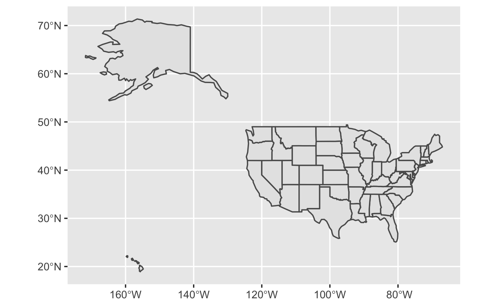<!-- -->

Notice that 1) `ggplot` automatically puts up the coordinates around your map; 2) the color theme used for plotting is the `ggplot` default (which looks good for graphs, but might not be the best for maps); 3) this dataset has all states (not only the lower 48), and also does not have any information on other countries, so it looks like the US is floating on nothing.

Let's try and solve these little issues step by step. First, let's use another theme besides the default theme in `ggplot`.

```{r, message = FALSE, warning = FALSE, tidy = TRUE}
ggplot()+geom_sf(data = states)+theme_minimal()
```
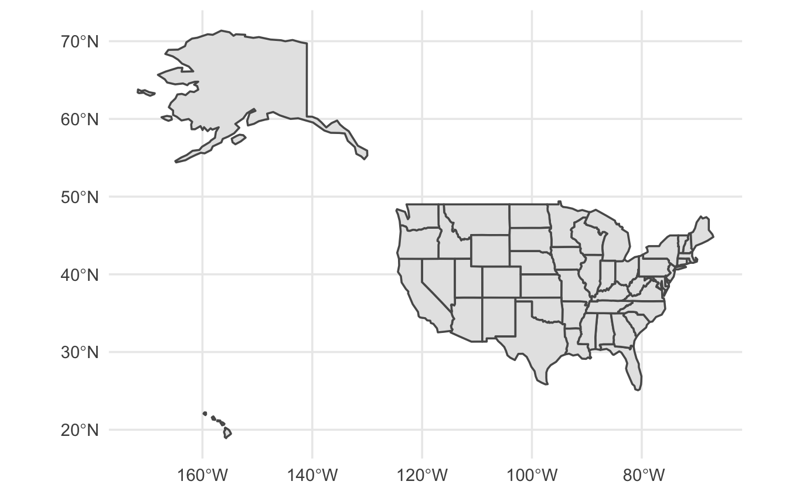<!-- -->

I like this better, it feels more clean.

Now, let's load an additional dataset with the countries of the world, so we can plot the states surrounded by neighbouring countries. This way, it won't feel like the US is floating in the middle of nowhere. Notice in the code below that to plot an extra spatial data (i.e., an extra *layer* in our map), we just need to repeat the geometry `geom_sf` with the new data.

```{r, message = FALSE, warning = FALSE, tidy = TRUE}
countries <- read_sf('data/world_countries/ne_110m_admin_0_countries.shp')
ggplot()+geom_sf(data = countries)+geom_sf(data = states)+theme_minimal()
```
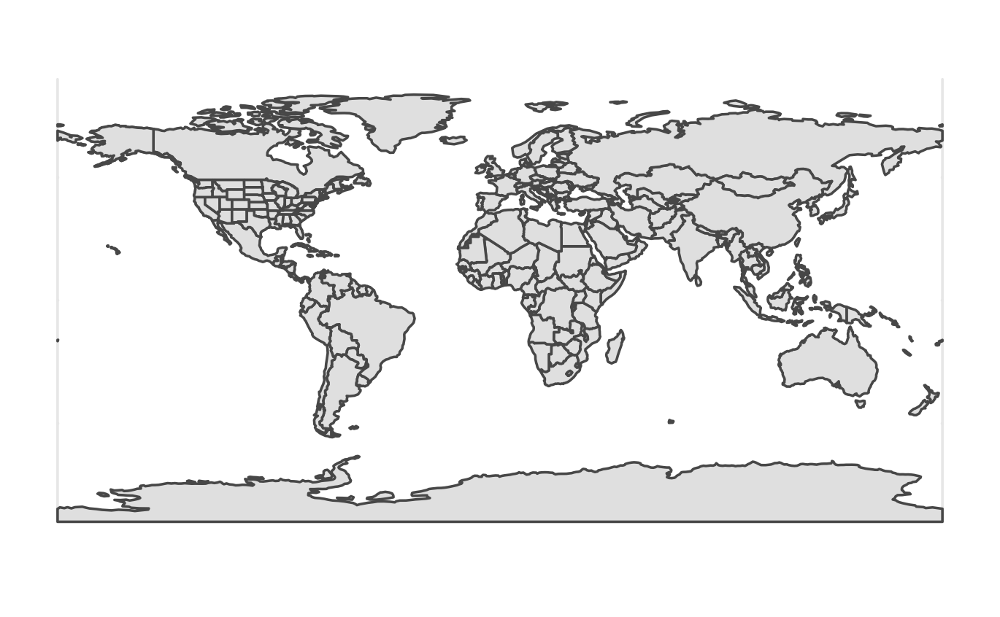<!-- -->
Now we se all states plus the countries around the US (Canada and Mexico). This is better, cause now the US area seems connected to the countries around (like in real life). However, the countries dataset that we used contains all countries in the world, so `ggplot` will be default try to plot everything (which is why our new map shows the whole world and no focus on our actual goal).

To solve this issue, we can use the function `coord_sf` to tell `ggplot` the *geographic extent* of our map. We need to do so by providing two vectors to this function: a vector called **xlim**, where we tell the lowest and hightest longitude (in that order) of our extent; 2) and a vector called **ylim**, where we tell the lowest and highest latitude (in that order) of our extent. These values are given as decimal coordinates. You can easily retrieve them by checking google maps (or any other map application), to figure our the lower and highest values that would encompass the area you wanna plot.

For our map, we will use the values shown bellow to focus on the lower 48 states.

```{r, message = FALSE, warning = FALSE, tidy = TRUE}
ggplot()+geom_sf(data = countries)+geom_sf(data = states)+
  coord_sf(xlim = c(-130.327727,-50.774995), ylim = c(24.321161,52.537236))+
  theme_minimal()
```
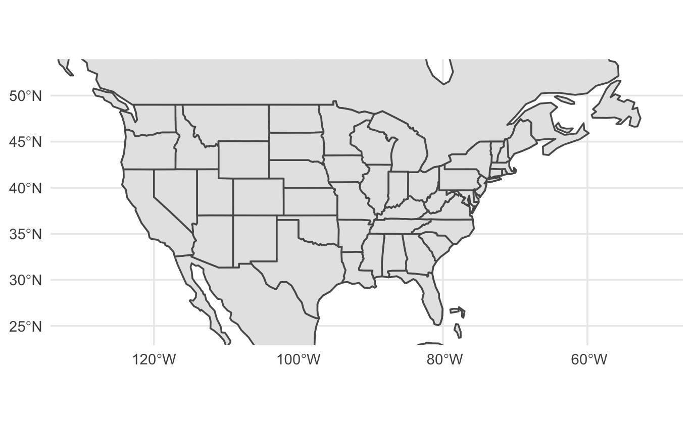<!-- -->
Now we have a map with a close up on the United States. Notice how, unlike before, we still maintain the lines of Mexico and Canada borders, which helps make the map look more realistic.

Now we can go on to save our map with the `ggsave` function. We have to say the name of our file and the values of width and height for the pic (which is in units of inch, by default). Changing the width and height will change the appearance of your final map, so it is nice to play around with these numbers, changing them, saving a file and checking it, until you get to a format that you like.

```{r, message = FALSE, warning = FALSE, tidy = TRUE}
ggsave('us_states.tif', width = 7, height = 9)
```

## Map 2: New York City with colored subway stops

Let's revise the steps to achieve this goal:

1. Load the boroughs shapefile
2. Load the subway stations shapefile
3. Plot both shapefiles together using `ggplot` and `geom_sf`
4. Customize our map to color the points by borough.

For this map, the only thing we have not learned yet how to do is to customize our map with colors. For now, let's load the data and plot the shapefiles.

```{r, message = FALSE, warning = FALSE, tidy = TRUE}
boroughs <- read_sf('data/nyc_boroughs/nyc_boroughs.shp')
subway <- read_sf('data/nyc_subway_stations/nyc_subway_stations.shp')
ggplot()+geom_sf(data=boroughs)+geom_sf(data=subway)
```
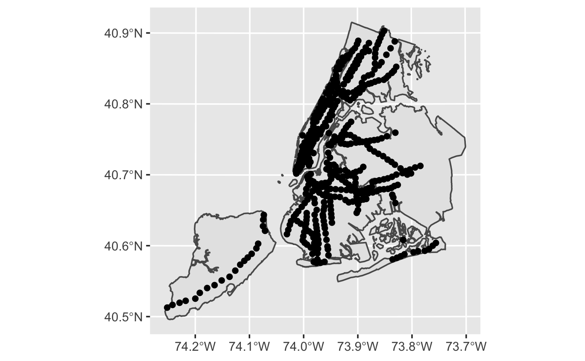<!-- -->

To change the color of our points, we can use the same rationale of basic plots in `ggplot`. We can add an aesthetics `color` to the point geometry. We tell `ggplot` that our points should be colored following the *bcode* column (which is the column in our shapefile that refers to the borough; use `View(subway)` to see the spreadsheet).

```{r, message = FALSE, warning = FALSE, tidy = TRUE}
# Customizing subway stops color
ggplot()+geom_sf(data=boroughs)+
  geom_sf(data=subway, aes(color = bcode))
```
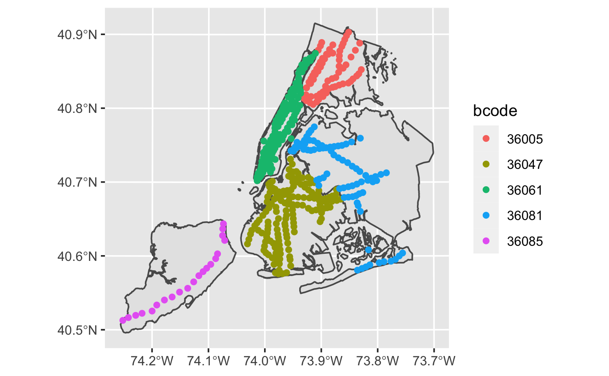<!-- -->
To further customize our plot, let's change the default theme used (`theme_bw()` focus on black and white lines). Let's also change the color of the boroughs. Since the boroughs are a polygon shapefile, we can use the aesthetics `fill` to inform the color we want.

```{r, message = FALSE, warning = FALSE, tidy = TRUE}
# Customizing background color
ggplot()+geom_sf(data=boroughs, fill = 'antiquewhite')+
  geom_sf(data=subway, aes (color = bcode))+theme_bw()
```
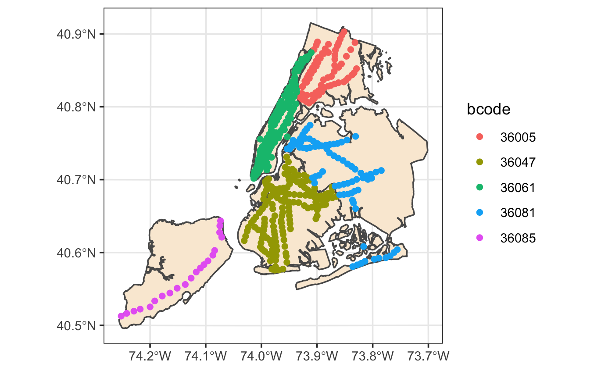<!-- -->
Notice that the legend of the colors are not telling us much. They follow the info in the *bcode* column of our shapefile. However, that column only has numbers (a specific code for the borough). We could create a column with the actual name of the borough, to use as a legend. But since that would be a little to much for now, let's just get rid of the legend by setting `legend.position ='none'` in our `theme()` function.

```{r, message = FALSE, warning = FALSE, tidy = TRUE}
ggplot()+geom_sf(data=boroughs, fill = 'antiquewhite')+
  geom_sf(data=subway, aes(color = bcode))+
  theme_bw()+
  theme(legend.position = "none")
```
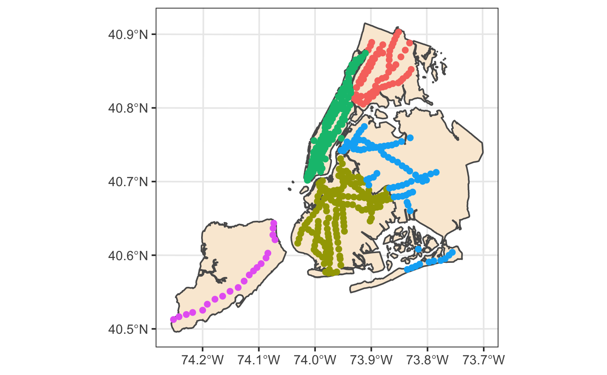<!-- -->
This already looks much better. Let's now focus on putting some information on our maps. We can add axes labels and a title the same way we did for basic graphs in `ggplot`: using the `labs()` function.

```{r, message = FALSE, warning = FALSE, tidy = TRUE}
# Customizing axis labels and title
ggplot()+geom_sf(data=boroughs, fill = 'antiquewhite')+
  geom_sf(data=subway, aes(color = bcode))+
  theme_bw()+
  theme(legend.position = "none")+
  labs(title = "NYC Subway Stops",
       x = 'Longitude',
       y = 'Latitude')
```
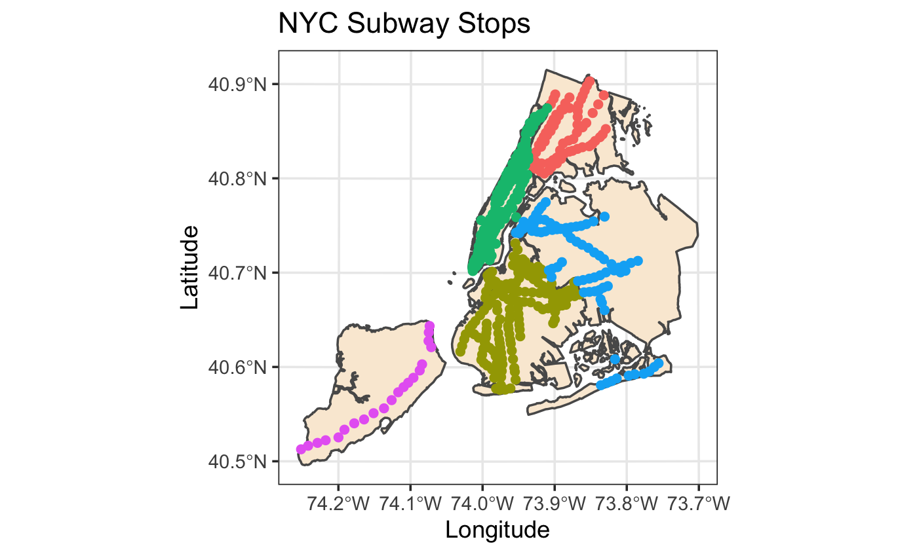<!-- -->
Finally, it would be nice to make our map look more professional by adding a scale and a north arrow indicator (basic items that are important in any map). We can do that by using some functions from the `ggspatial` package.

```{r, message = FALSE, warning = FALSE, tidy = TRUE}
library('ggspatial')
```

To add those items, let's use the functions `annotation_scale` and `annotation_north_arrow`. We can tell `ggplot` where in our map we want those items to show up ('*br*' means the items will be plotted in the *b*ottom *r*ight corner of the map).

```{r, message = FALSE, warning = FALSE, tidy = TRUE}
# Adding scale and north arrow
ggplot()+geom_sf(data=boroughs, fill = 'antiquewhite')+
  geom_sf(data=subway, aes(color = bcode))+
  theme_bw()+
  theme(legend.position = "none")+
  labs(title = "NYC Subway Stops",
       x = 'Longitude',
       y = 'Latitude')+
  annotation_scale(location = "br")+
  annotation_north_arrow(location = "br")
```
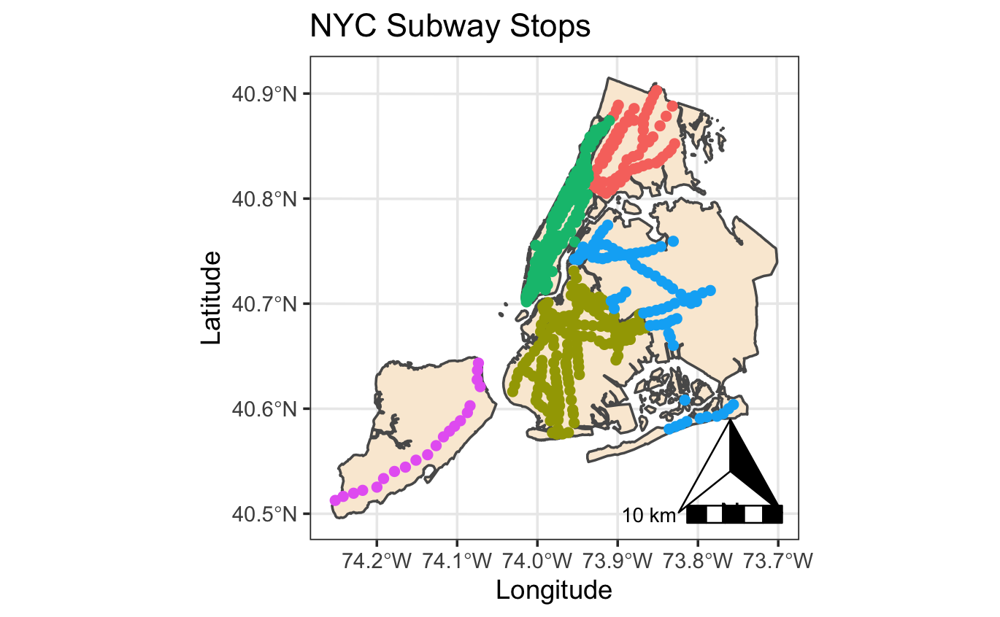<!-- -->
Looking better, but our arrow and scale are being plotted on top of each other. The `annotation` functions allows us to customize these items a little bit. For `annotation_scale`, let's set a width_hint, which will determine the width of our scale in our final map (in inches). Let's also customize our north arrow: with `pad_x` and `pad_y`, we can nudge our arrow away from the borders of our map (in this case, 0.3 inches in the x axis, and 0.5 inches in the y axis). We also change the style of our arrow to one of the styles available in the function (`north_arrow_fancy_orienteering` sounds prettier).

```{r, message = FALSE, warning = FALSE, tidy = TRUE}
# Adjusting scale and north arrows
ggplot()+geom_sf(data=boroughs, fill = 'antiquewhite')+
  geom_sf(data=subway, aes(color = bcode))+
  theme_bw()+
  theme(legend.position = "none")+
  labs(title = "NYC Subway Stops",
       x = 'Longitude',
       y = 'Latitude')+
  annotation_scale(location = "br", width_hint = 0.3)+
  annotation_north_arrow(location = "br",
                       pad_x = unit(0.3, "in"), pad_y = unit(0.5, "in"),
                       style = north_arrow_fancy_orienteering)
```
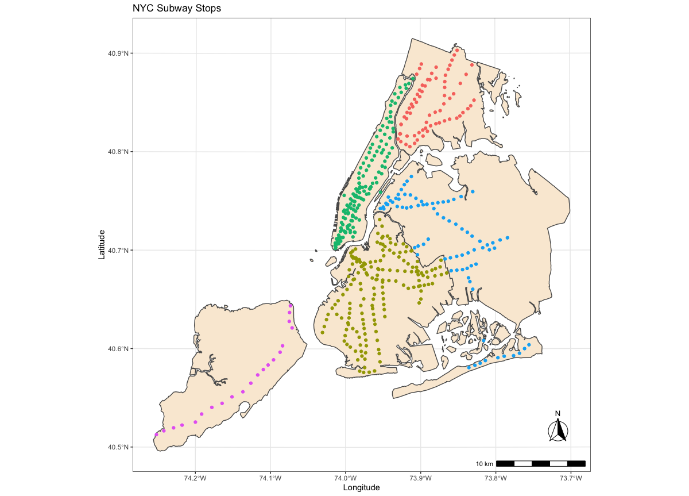<!-- -->
Notice how in this final figure above, the points are smaller and the map seems more spaced out. This is because this is the file saved using the `ggsave` function, where we can adjust width and height of our pictures. The previous figures above were directly from the R Console, where R will try to fit the whole map into your plot screen to the right (which may sometimes squeeze everything closer). This is why it is important to save your maps, testing out different values for width and height, to see which values give you a figure with nice proportions.

Here, I am saving my maps with width = 7 and height = 9, which I found out (from previous attempt) to yield nice sized figures.

```{r, message = FALSE, warning = FALSE, tidy = TRUE}
ggsave('nyc_subway_stops.tif', width = 7, height = 9)
```

And there we go! We have completed our first ever maps using `ggplot`.


